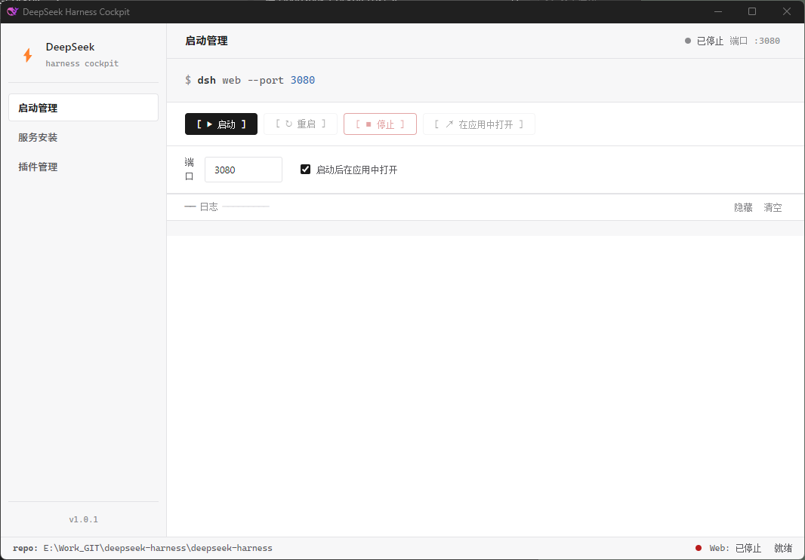
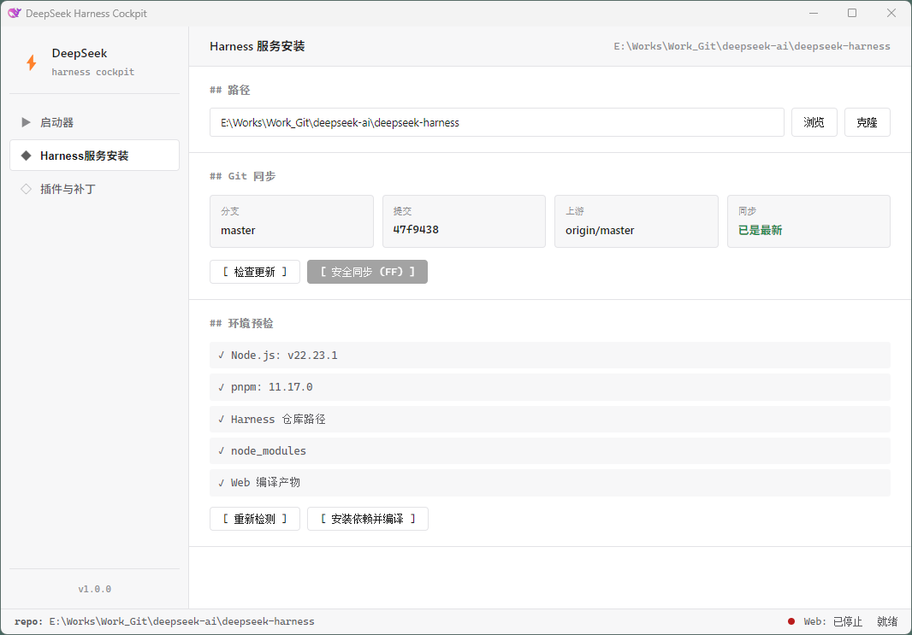
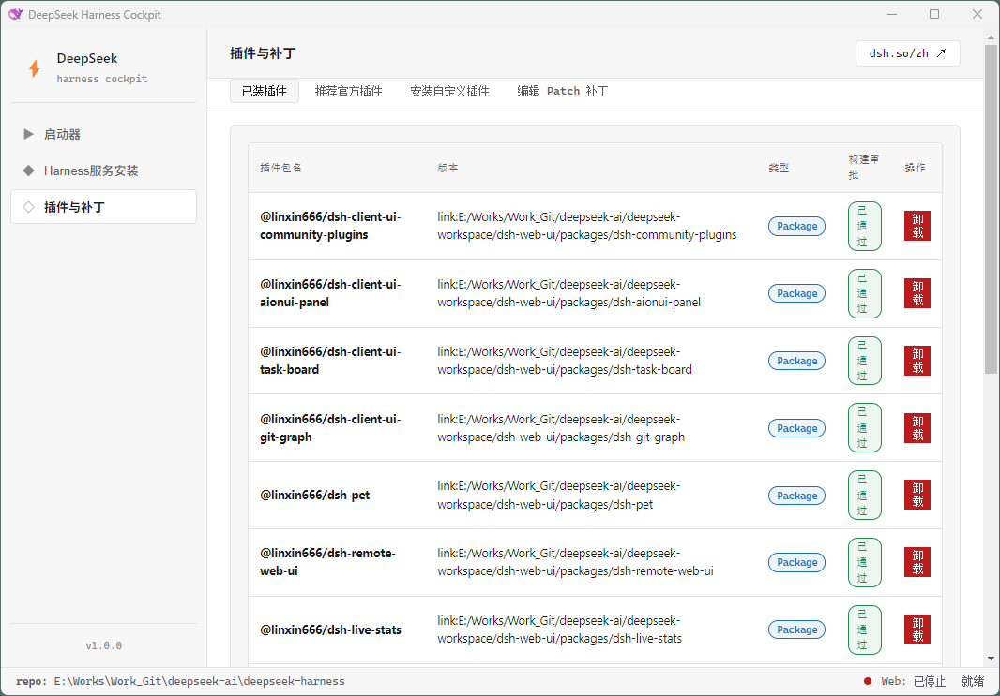
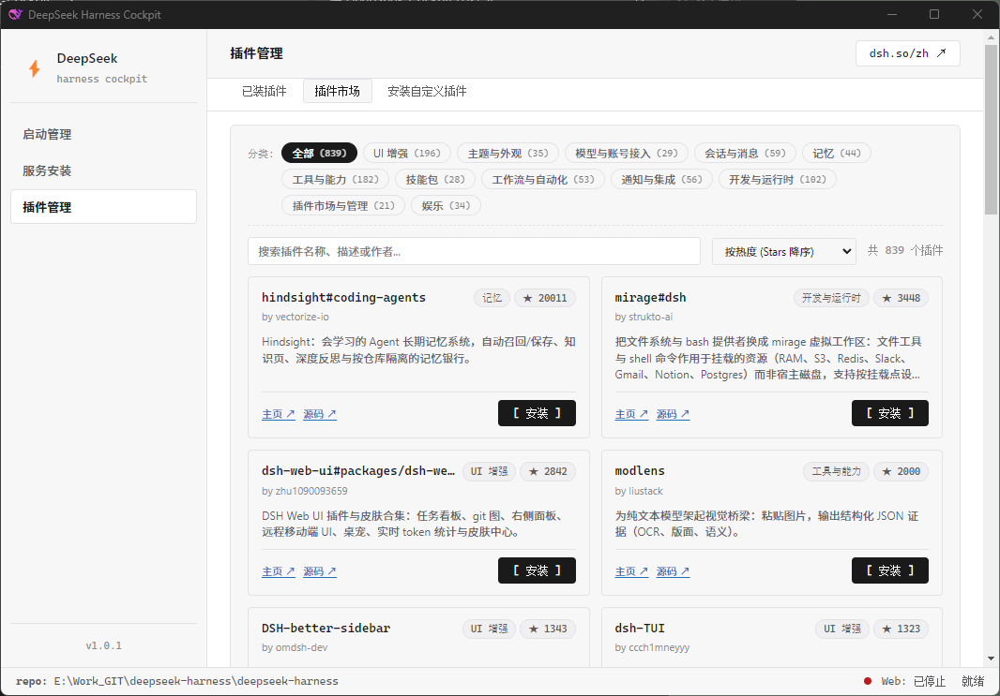
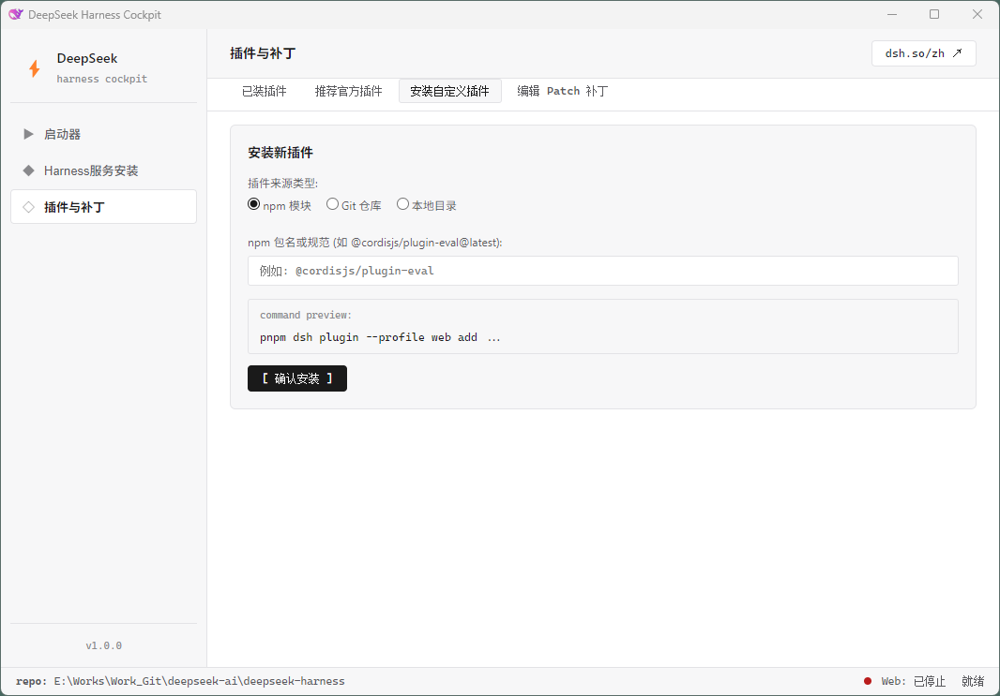

# DeepSeek Harness Cockpit (桌面控制台)

> Windows 本地轻量级 DeepSeek Harness 管理桌面助手，基于 Electron 与原生 Web 技术构建。

---

## 🌟 核心特性与设计哲学

- **极简无负担 (Ponytail)**: 拒绝重型前端框架与多余依赖，零数据库，原生 HTML/CSS/JavaScript + Node.js 原生标准库驱动。
- **安全第一**:
  - **无 Shell 命令注入**: 所有子进程执行均使用严格的参数数组（`shell: false`），杜绝字符串拼接命令。
  - **Git 守则**: 仅允许安全快进拉取 (`git pull --ff-only`)，绝不自动执行破坏性 `reset`、`clean` 或强制覆盖本地修改。
  - **隐私隔离**: 绝不读取、存储或外泄 Harness 的 `.env`、API Key 或模型凭据。
- **Web 服务生命周期托管**:
  - 显式安装与构建 (`pnpm install && pnpm run build`)；
  - 一键运行 Web profile (`pnpm dsh web --port <port>`)，原生 HTTP 探活与默认浏览器直调；
  - 应用关闭时自动递归清理子进程树，杜绝孤儿后台进程。
- **插件管理**:
  - 800+ 社区与生态插件市场，支持 12 大分类管理、即时搜索、排序与一键安装；
  - 支持 npm / Git / 本地目录多源插件安装；
  - 关键操作前自动快照备份（保留最近 10 次历史记录）。

---

## 🛠️ 系统要求与前置准备

- **操作系统**: Windows 10 / Windows 11 (64-bit)
- **Node.js**: >= 20.0.0
- **pnpm**: >= 9.0.0
- **Git**: 官方 Git for Windows

---

## 🚀 快速启动与开发

```bash
# 1. 安装项目依赖
pnpm install

# 2. 运行全体自动化单元与集成测试 (内置 node:test)
pnpm test

# 3. 本地启动桌面应用
pnpm start

# 4. 一键 PowerShell 脚本打包 (默认生成单文件便携 exe)
.\build.ps1

# 5. 或通过 pnpm 执行指定编译
pnpm run build:portable   # 便携免安装版 exe
pnpm run build:nsis       # 安装包 (NSIS Setup.exe)
pnpm run build:dir        # 解压即用目录 (dist/win-unpacked)
pnpm run build            # 同时生成安装包与便携版
```

---

## 📸 界面预览

### 启动管理：Web 服务生命周期托管



### 服务安装与 Git 快进同步



### 插件管理







---

## 📂 项目结构说明

```
DeepSeek-Cockpit/
├── Plan/                          # 需求与技术规范设计
├── docs/superpowers/plans/        # 实施计划与执行记录
├── resources/                     # 应用图标与官方推荐插件目录
├── src/
│   ├── main.js                    # Electron 主进程入口与 IPC 调度
│   ├── preload.js                 # 上下文隔离桥接 (window.cockpit)
│   ├── services/                  # 核心服务层
│   │   ├── command-runner.js      # 安全命令执行与托管进程
│   │   ├── config-store.js        # 配置持久化与原子写入
│   │   ├── git-service.js         # Git 状态巡检与快进同步
│   │   ├── harness-service.js     # Web 服务启停、探活与浏览器调起
│   │   ├── path-resolver.js       # DSH 路径与执行文件解析
│   │   ├── plugin-source.js       # 插件源校验与白名单机制
│   │   └── profile-service.js     # 插件增删改查、备份与补丁校验
│   └── renderer/                  # 原生现代 UI (无框架)
│       ├── index.html             # 结构布局
│       ├── styles.css             # 样式表
│       └── app.js                 # 渲染控制逻辑
├── test/                          # 自动化测试套件
└── electron-builder.yml           # Windows 打包配置
```

---

## 📄 开源许可证

MIT License © 2026 DeepSeek Cockpit Team
